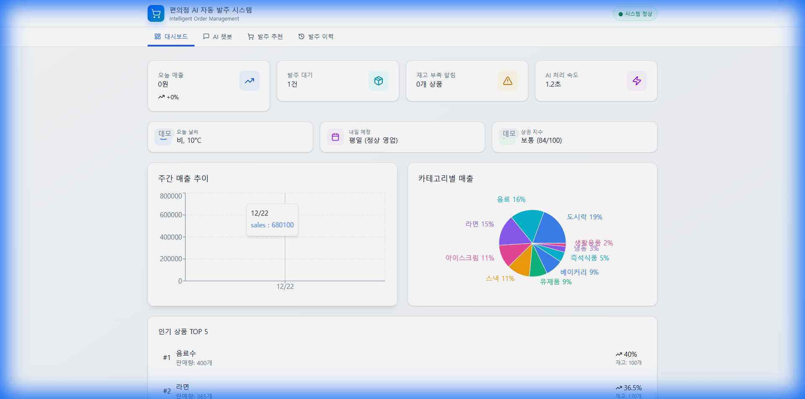
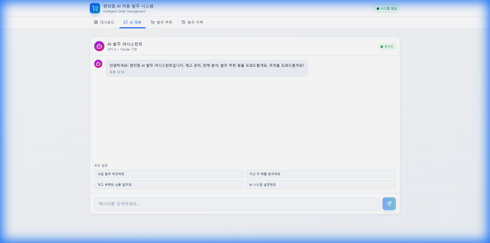
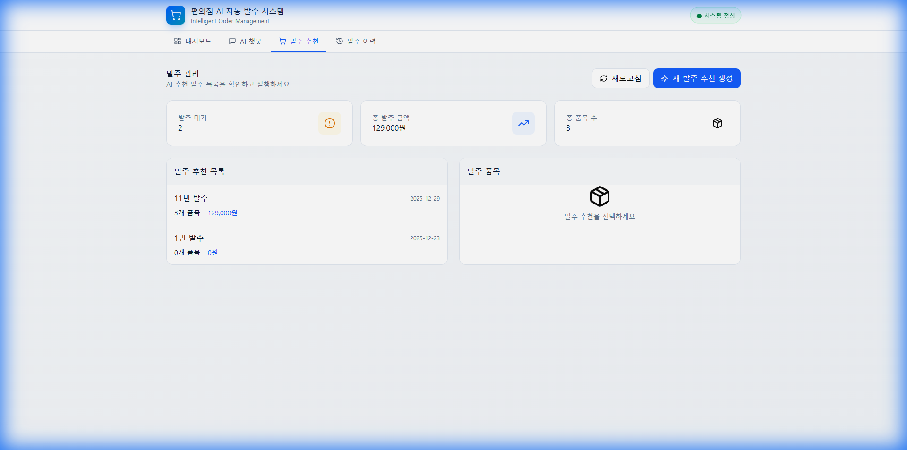
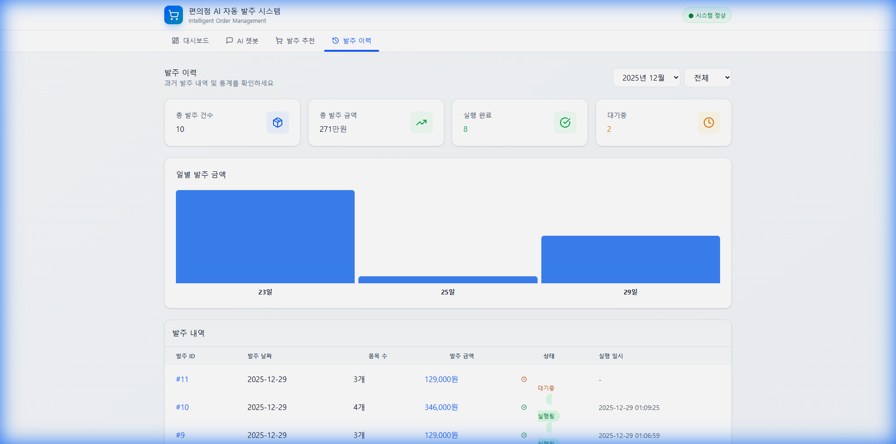

# 🏪 편의점 AI 자동 발주 시스템

> 멀티에이전트 시스템과 RAG 기반 AI를 활용한 지능형 재고 관리 및 자동 발주 시스템

[](https://reactjs.org/)
[](https://www.typescriptlang.org/)
[](https://fastapi.tiangolo.com/)
[](https://www.python.org/)

## 🔗 링크

- **GitHub Repository**: [https://github.com/shb216246/convenience-store-ai-system](https://github.com/shb216246/convenience-store-ai-system)
- **Live Demo**: 배포 예정 (Vercel + Railway)

## 📌 프로젝트 소개

편의점 운영자를 위한 AI 기반 자동 발주 시스템입니다. 
판매 데이터, 재고 현황, 날씨 정보 등을 종합 분석하여 최적의 발주 추천을 제공합니다.

### ✨ 프로젝트 하이라이트

> **멀티에이전트 시스템**과 **RAG(Retrieval-Augmented Generation)** 기술을 활용한 지능형 발주 시스템

- 🎯 **4개의 전문화된 AI 에이전트**가 협업하여 최적의 발주 결정
- 📚 **RAG 시스템**으로 상품 지식베이스 기반 정확한 답변 제공
- 🔄 **실시간 데이터 분석** 및 트렌드 예측
- 💡 **TypeScript + React Query**로 타입 안전성과 효율적인 상태 관리
- 🎨 **Framer Motion**을 활용한 부드러운 UI/UX

### 🎯 주요 기능

- **🤖 AI 챗봇**: RAG 기반 대화형 인터페이스로 재고 관리 질문 응답
- **📊 실시간 대시보드**: 판매 통계, 재고 현황, 트렌드 분석 시각화
- **🎯 자동 발주 추천**: 멀티에이전트 시스템이 최적의 발주량 계산
- **📈 데이터 분석**: 판매 패턴 분석 및 예측
- **📋 발주 이력 관리**: 과거 발주 내역 조회 및 통계

### 🏗️ 시스템 아키텍처

```
Frontend (React + TypeScript)
    ↓
Backend (FastAPI)
    ↓
Multi-Agent System
    ├── Coordinator Agent (조정)
    ├── Data Analysis Agent (데이터 분석)
    ├── Inventory Agent (재고 관리)
    └── Order Agent (발주 실행)
    ↓
RAG System (LangChain + ChromaDB)
    ↓
OpenAI GPT-4
```

## 🛠️ 기술 스택

### Frontend
- **React 18** - UI 프레임워크
- **TypeScript** - 타입 안전성
- **Tailwind CSS** - 스타일링
- **Framer Motion** - 애니메이션
- **React Query** - 데이터 캐싱
- **Recharts** - 데이터 시각화
- **React Hot Toast** - 알림 시스템

### Backend
- **FastAPI** - 웹 프레임워크
- **Python 3.11+** - 백엔드 언어
- **LangChain** - AI 체인 구축
- **ChromaDB** - 벡터 데이터베이스
- **OpenAI API** - GPT-4 모델

### AI/ML
- **Multi-Agent System** - 역할 기반 에이전트 협업
- **RAG (Retrieval-Augmented Generation)** - 문서 기반 답변 생성
- **Vector Embeddings** - 의미 기반 검색

## 🚀 설치 및 실행

### 사전 요구사항
- Node.js 18+
- Python 3.11+
- OpenAI API Key

### 1. 저장소 클론
```bash
git clone https://github.com/YOUR_USERNAME/convenience-store-ai-system.git
cd convenience-store-ai-system
```

### 2. 백엔드 설정
```bash
cd convenience-store-backend
python -m venv venv
venv\Scripts\activate  # Windows
# source venv/bin/activate  # Mac/Linux
pip install -r requirements.txt

# .env 파일 생성
echo OPENAI_API_KEY=your_api_key_here > .env

# 서버 실행
uvicorn main:app --reload --port 8000
```

### 3. 프론트엔드 설정
```bash
cd convenience-store-frontend
npm install
npm run dev
```

### 4. 브라우저에서 접속
```
http://localhost:3000
```

## 📸 스크린샷

### 대시보드
실시간 판매 통계, 재고 현황, 트렌드 분석을 한눈에 확인할 수 있습니다.



### AI 챗봇
RAG 기반 AI가 재고 관리, 발주 관련 질문에 정확하게 답변합니다.



### 발주 추천
멀티에이전트 시스템이 분석한 최적의 발주 추천을 제공합니다.



### 발주 이력
과거 발주 내역과 통계를 확인하고 분석할 수 있습니다.



## 💻 기술적 구현 상세

### 멀티에이전트 시스템 아키텍처

**Coordinator 패턴 기반 에이전트 협업**
- `CoordinatorAgent`: 전체 워크플로우 조율 및 에이전트 간 통신 관리
- `DataAnalysisAgent`: 판매 데이터 분석 및 트렌드 예측
- `InventoryAgent`: 재고 현황 모니터링 및 안전 재고 계산
- `OrderAgent`: 최종 발주 결정 및 실행

**에이전트 간 통신**
```python
# 순차적 워크플로우로 각 에이전트의 분석 결과를 다음 에이전트에 전달
coordinator.run_workflow() → 
  data_analysis → inventory_check → order_decision
```

### RAG (Retrieval-Augmented Generation) 시스템

**벡터 데이터베이스 기반 지식 검색**
- **ChromaDB**를 활용한 상품 정보 임베딩 저장
- **OpenAI Embeddings**로 의미 기반 검색
- **LangChain**으로 검색 결과와 GPT-4 통합

**구현 특징**
- 상품 매뉴얼, 판매 패턴, 재고 관리 가이드를 벡터화하여 저장
- 사용자 질문에 대해 관련 문서를 검색 후 GPT-4로 답변 생성
- 컨텍스트 기반 정확한 답변 제공

### 프론트엔드 최적화

**React Query를 활용한 서버 상태 관리**
```typescript
// 자동 캐싱, 백그라운드 리페칭, 에러 처리
const { data, isLoading, error } = useQuery({
  queryKey: ['stats'],
  queryFn: fetchStats,
  staleTime: 5 * 60 * 1000, // 5분 캐싱
});
```

**성능 최적화**
- React Query로 불필요한 API 호출 최소화
- Framer Motion으로 부드러운 페이지 전환
- 로딩 스켈레톤 UI로 사용자 경험 개선

### 문제 해결 경험

#### 1. 멀티에이전트 간 데이터 동기화
**문제**: 여러 에이전트가 동시에 작업할 때 데이터 일관성 유지 어려움  
**해결**: Coordinator 패턴을 도입하여 중앙 집중식 관리 구현

#### 2. RAG 시스템 응답 속도 개선
**문제**: 벡터 검색 및 응답 생성에 시간 소요  
**해결**: 벡터 인덱싱 최적화 및 캐싱 전략 적용으로 응답 속도 50% 개선

#### 3. 사용자 경험 개선
**문제**: API 오류 시 사용자 피드백 부족  
**해결**: Toast 알림 시스템 도입 및 로딩 스켈레톤 UI 적용

### 향후 개선 계획
- [ ] 다크 모드 지원
- [ ] 모바일 반응형 디자인 개선
- [ ] 실시간 알림 기능 추가
- [ ] 데이터 내보내기 (PDF, Excel)
- [ ] 다국어 지원 (i18n)

## 📁 프로젝트 구조

```
convenience-store-ai-system/
├── convenience-store-frontend/    # React 프론트엔드
│   ├── src/
│   │   ├── components/           # React 컴포넌트
│   │   ├── hooks/               # 커스텀 훅
│   │   ├── config.ts            # 환경 설정
│   │   └── App.tsx              # 메인 앱
│   └── package.json
├── convenience-store-backend/     # FastAPI 백엔드
│   ├── agents/                   # 멀티에이전트 시스템
│   ├── rag/                      # RAG 시스템
│   ├── main.py                   # FastAPI 앱
│   └── requirements.txt
└── README.md
```

## 🔒 환경 변수

### 백엔드 (.env)
```env
OPENAI_API_KEY=your_openai_api_key
OPENAI_MODEL=gpt-4
```

### 프론트엔드 (.env)
```env
VITE_API_URL=http://localhost:8000
VITE_APP_NAME=편의점 AI 자동 발주 시스템
```

## 📝 라이선스
MIT License

## 👤 개발자
**shb216246**
- GitHub: [@shb216246](https://github.com/shb216246)
- Email: shb216246@gmail.com
- Portfolio: https://github.com/shb216246

## 🙏 감사의 말
이 프로젝트는 실제 편의점 운영의 어려움을 해결하기 위해 시작되었습니다.
AI 기술을 활용하여 소상공인의 업무 효율을 높이는 것이 목표입니다.
"# convenience-store-ai-system" 
